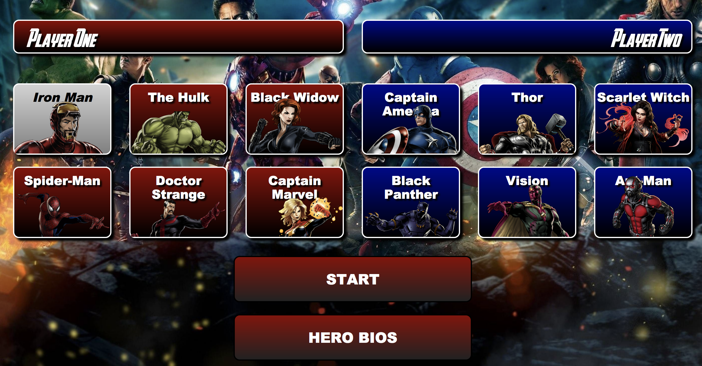
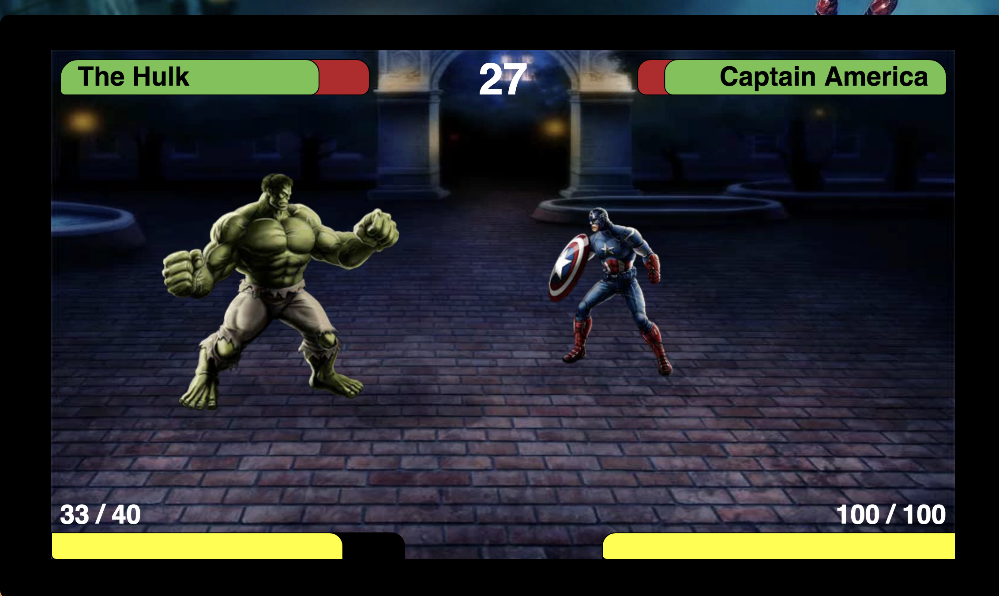

# Super Smash Heroes

###  Arcade style fighting game with Super Heroes August 27, 2018

### By **Connor McCarthy, Chris Crow, David Zhu, & Brian Nelson**

## Description

Hosted: https://nelsonsbrian.github.io/Marvel-Combat/

An arcade style fighting game that uses Marvel super heroes as it's characters. Play can choose their desired characters and face off against another player in an 'mortal-combat' style arcade game. Each hero has a basic punching attack and 2 other special attacks. The hero can move left and right and block incoming attacks in real-time. First player to knock the other player out, or whomever has the most hit points remaining at the end of the match is the winner.

The game was made after 4 weeks of our Intro to Programming week at Epicodus. The 4 of us contributed to this project solely utilizing html, javascript, and css styling. We utilized P5 library for image manuipulation and the overall project was a pure demonstration of the concepts and techniques we learned only from coding for the past 4 weeks.

## Specs

### Webpage Screenshot

### Gameplay Screenshot

## Game and GamePlay

| Spec | 
| :-------------     | 
| **Create a sprite that moves with key inputs.** |
| **Create a 2nd sprite that doesn't move.** |
| **Add collision functionality between the 2 sprites.** |
| **Add character attributes(hitpoint, defense, etc) and create basic health indicator on screen** |
| **Add sprites for moving.** |
| **Create basic attack and sprite.** |
| **Add damage to attack** |
| **Add Game over when dummy reaches 0 hitpoints** |
| **Add laser attack to ironMan** |
| **Add sprite changes for neutral, attack, defend, special, and range attacks** |
| **Add 2nd player controls and attacks based on facing the opposite way as player 1** |
| **Add Timer to game screen and end game after time expires. Play with higher health % wins** |
| **Add global cooldown for attacks** |
| **Refactor keybinding code to allow for multiple heroes and their attacks** |
| **Refactor code remove hardcoded player references** |
| **Add additional heroes and attacks** |

## Webpage

| Spec |
| :-------------     | 
| **Add basic html webpage that displays the gameboard** |
| **Add wallpaper and titles.** |
| **Add Sound to game board when game begins** |
| **Add hero bio profiles** |
| **Add key map diagram** |

## Setup/Installation Requirements

1. Clone this repository: https://github.com/nelsonsbrian/superSmashHeroes
2. Open the command line--and navigate into the repository.
3. On your browser, open the index.html and enjoy!

## Known Bugs
* No known bugs at this time.

## Technologies Used
* JavaScript
* P5 JavaScript Library
* jQuery & Bootstrap
* HTML & CSS

## Support and contact details

Brian Nelson nelsonsbrian@gmail.com

## License

*{This software is licensed under the MIT license}*

Copyright (c) 2018 **Connor McCarthy, Chris Crow, David Zhu, & Brian Nelson**
